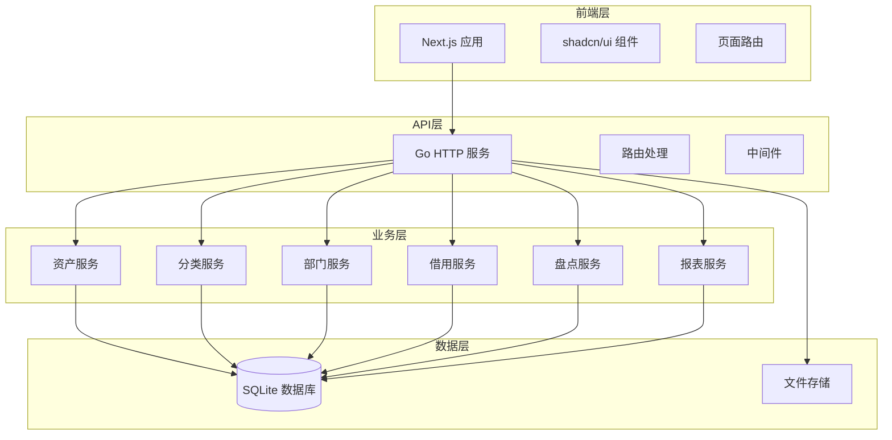
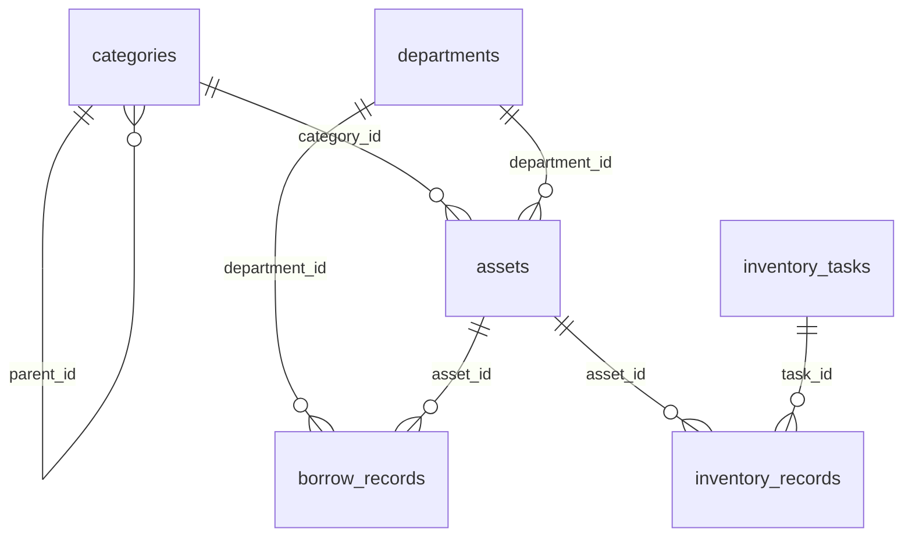

# 企业固定资产管理系统 - 设计文档

## 概述

本设计文档描述了将DooTask AI插件改造为轻量级企业固定资产管理系统的技术架构和实现方案。系统采用Next.js + Go + SQLite的技术栈，提供完整的资产生命周期管理功能。

## 架构设计

### 整体架构



### 技术栈

#### 前端技术
- **Next.js 15** - React全栈框架，使用App Router
- **shadcn/ui** - 现代化UI组件库
- **Tailwind CSS** - 原子化CSS框架
- **TypeScript** - 类型安全
- **React Hook Form** - 表单处理
- **Recharts** - 图表展示

#### 后端技术
- **Go 1.21+** - 高性能HTTP服务
- **Gin** - Web框架
- **GORM** - ORM框架
- **SQLite** - 轻量级数据库
- **JWT** - 会话管理（可选）

## 数据模型设计

### 数据库表结构

```sql
-- 资产分类表
CREATE TABLE categories (
    id INTEGER PRIMARY KEY AUTOINCREMENT,
    name VARCHAR(100) NOT NULL,
    code VARCHAR(50) UNIQUE NOT NULL,
    parent_id INTEGER,
    description TEXT,
    attributes JSON, -- 分类特定属性模板
    created_at DATETIME DEFAULT CURRENT_TIMESTAMP,
    updated_at DATETIME DEFAULT CURRENT_TIMESTAMP,
    FOREIGN KEY (parent_id) REFERENCES categories(id)
);

-- 部门表
CREATE TABLE departments (
    id INTEGER PRIMARY KEY AUTOINCREMENT,
    name VARCHAR(100) NOT NULL,
    code VARCHAR(50) UNIQUE NOT NULL,
    manager VARCHAR(100),
    contact VARCHAR(100),
    description TEXT,
    created_at DATETIME DEFAULT CURRENT_TIMESTAMP,
    updated_at DATETIME DEFAULT CURRENT_TIMESTAMP
);

-- 资产表
CREATE TABLE assets (
    id INTEGER PRIMARY KEY AUTOINCREMENT,
    asset_no VARCHAR(100) UNIQUE NOT NULL, -- 资产编号
    name VARCHAR(200) NOT NULL,
    category_id INTEGER NOT NULL,
    department_id INTEGER,
    brand VARCHAR(100),
    model VARCHAR(100),
    serial_number VARCHAR(100),
    purchase_date DATE,
    purchase_price DECIMAL(12,2),
    supplier VARCHAR(200),
    warranty_period INTEGER, -- 保修期（月）
    status VARCHAR(20) DEFAULT 'available', -- available, borrowed, maintenance, scrapped
    location VARCHAR(200),
    responsible_person VARCHAR(100),
    description TEXT,
    image_url VARCHAR(500),
    custom_attributes JSON, -- 自定义属性
    created_at DATETIME DEFAULT CURRENT_TIMESTAMP,
    updated_at DATETIME DEFAULT CURRENT_TIMESTAMP,
    FOREIGN KEY (category_id) REFERENCES categories(id),
    FOREIGN KEY (department_id) REFERENCES departments(id)
);

-- 借用记录表
CREATE TABLE borrow_records (
    id INTEGER PRIMARY KEY AUTOINCREMENT,
    asset_id INTEGER NOT NULL,
    borrower_name VARCHAR(100) NOT NULL,
    borrower_contact VARCHAR(100),
    department_id INTEGER,
    borrow_date DATETIME NOT NULL,
    expected_return_date DATETIME,
    actual_return_date DATETIME,
    status VARCHAR(20) DEFAULT 'borrowed', -- borrowed, returned, overdue
    purpose TEXT,
    notes TEXT,
    created_at DATETIME DEFAULT CURRENT_TIMESTAMP,
    updated_at DATETIME DEFAULT CURRENT_TIMESTAMP,
    FOREIGN KEY (asset_id) REFERENCES assets(id),
    FOREIGN KEY (department_id) REFERENCES departments(id)
);

-- 盘点任务表
CREATE TABLE inventory_tasks (
    id INTEGER PRIMARY KEY AUTOINCREMENT,
    task_name VARCHAR(200) NOT NULL,
    task_type VARCHAR(50) DEFAULT 'full', -- full, category, department
    scope_filter JSON, -- 盘点范围过滤条件
    status VARCHAR(20) DEFAULT 'pending', -- pending, in_progress, completed
    start_date DATETIME,
    end_date DATETIME,
    created_by VARCHAR(100),
    notes TEXT,
    created_at DATETIME DEFAULT CURRENT_TIMESTAMP,
    updated_at DATETIME DEFAULT CURRENT_TIMESTAMP
);

-- 盘点记录表
CREATE TABLE inventory_records (
    id INTEGER PRIMARY KEY AUTOINCREMENT,
    task_id INTEGER NOT NULL,
    asset_id INTEGER NOT NULL,
    expected_status VARCHAR(20), -- 系统中的状态
    actual_status VARCHAR(20), -- 实际盘点状态
    result VARCHAR(20), -- normal, surplus, deficit, damaged
    notes TEXT,
    checked_at DATETIME,
    checked_by VARCHAR(100),
    created_at DATETIME DEFAULT CURRENT_TIMESTAMP,
    FOREIGN KEY (task_id) REFERENCES inventory_tasks(id),
    FOREIGN KEY (asset_id) REFERENCES assets(id)
);

-- 操作日志表
CREATE TABLE operation_logs (
    id INTEGER PRIMARY KEY AUTOINCREMENT,
    table_name VARCHAR(50) NOT NULL,
    record_id INTEGER NOT NULL,
    operation VARCHAR(20) NOT NULL, -- create, update, delete
    old_data JSON,
    new_data JSON,
    operator VARCHAR(100),
    ip_address VARCHAR(45),
    user_agent TEXT,
    created_at DATETIME DEFAULT CURRENT_TIMESTAMP
);

-- 系统配置表
CREATE TABLE system_configs (
    id INTEGER PRIMARY KEY AUTOINCREMENT,
    config_key VARCHAR(100) UNIQUE NOT NULL,
    config_value TEXT,
    description TEXT,
    created_at DATETIME DEFAULT CURRENT_TIMESTAMP,
    updated_at DATETIME DEFAULT CURRENT_TIMESTAMP
);
```

### 数据模型关系



## 组件设计

### 前端页面结构

```
app/
├── layout.tsx                 # 根布局
├── page.tsx                   # 首页（重定向到dashboard）
├── dashboard/                 # 仪表板
│   └── page.tsx
├── assets/                    # 资产管理
│   ├── page.tsx              # 资产列表
│   ├── new/
│   │   └── page.tsx          # 新增资产
│   ├── [id]/
│   │   ├── page.tsx          # 资产详情
│   │   └── edit/
│   │       └── page.tsx      # 编辑资产
│   └── import/
│       └── page.tsx          # 批量导入
├── categories/                # 分类管理
│   ├── page.tsx              # 分类列表
│   └── [id]/
│       └── page.tsx          # 分类详情
├── departments/               # 部门管理
│   ├── page.tsx              # 部门列表
│   └── [id]/
│       └── page.tsx          # 部门详情
├── borrow/                    # 借用管理
│   ├── page.tsx              # 借用记录
│   ├── new/
│   │   └── page.tsx          # 新增借用
│   └── return/
│       └── page.tsx          # 归还处理
├── inventory/                 # 盘点管理
│   ├── page.tsx              # 盘点任务列表
│   ├── new/
│   │   └── page.tsx          # 创建盘点任务
│   └── [id]/
│       ├── page.tsx          # 盘点执行
│       └── report/
│           └── page.tsx      # 盘点报告
└── reports/                   # 报表统计
    ├── page.tsx              # 报表首页
    ├── assets/
    │   └── page.tsx          # 资产统计报表
    ├── borrow/
    │   └── page.tsx          # 借用统计报表
    └── inventory/
        └── page.tsx          # 盘点统计报表
```

### 核心组件设计

#### 1. 资产管理组件

```typescript
// components/assets/AssetList.tsx
interface AssetListProps {
  filters?: AssetFilters;
  onAssetSelect?: (asset: Asset) => void;
}

// components/assets/AssetForm.tsx
interface AssetFormProps {
  asset?: Asset;
  onSubmit: (data: AssetFormData) => void;
  onCancel: () => void;
}

// components/assets/AssetCard.tsx
interface AssetCardProps {
  asset: Asset;
  showActions?: boolean;
  onEdit?: (asset: Asset) => void;
  onDelete?: (asset: Asset) => void;
}
```

#### 2. 分类管理组件

```typescript
// components/categories/CategoryTree.tsx
interface CategoryTreeProps {
  categories: Category[];
  selectedId?: number;
  onSelect: (category: Category) => void;
  onAdd?: (parentId?: number) => void;
  onEdit?: (category: Category) => void;
  onDelete?: (category: Category) => void;
}
```

#### 3. 借用管理组件

```typescript
// components/borrow/BorrowForm.tsx
interface BorrowFormProps {
  asset?: Asset;
  onSubmit: (data: BorrowFormData) => void;
  onCancel: () => void;
}

// components/borrow/BorrowRecordList.tsx
interface BorrowRecordListProps {
  records: BorrowRecord[];
  showAssetInfo?: boolean;
  onReturn?: (record: BorrowRecord) => void;
}
```

## API设计

### RESTful API 端点

```go
// 资产管理 API
GET    /api/assets              // 获取资产列表
POST   /api/assets              // 创建资产
GET    /api/assets/:id          // 获取资产详情
PUT    /api/assets/:id          // 更新资产
DELETE /api/assets/:id          // 删除资产
POST   /api/assets/import       // 批量导入资产
GET    /api/assets/export       // 导出资产

// 分类管理 API
GET    /api/categories          // 获取分类树
POST   /api/categories          // 创建分类
GET    /api/categories/:id      // 获取分类详情
PUT    /api/categories/:id      // 更新分类
DELETE /api/categories/:id      // 删除分类

// 部门管理 API
GET    /api/departments         // 获取部门列表
POST   /api/departments         // 创建部门
GET    /api/departments/:id     // 获取部门详情
PUT    /api/departments/:id     // 更新部门
DELETE /api/departments/:id     // 删除部门

// 借用管理 API
GET    /api/borrow-records      // 获取借用记录
POST   /api/borrow-records      // 创建借用记录
PUT    /api/borrow-records/:id/return // 归还资产
GET    /api/borrow-records/overdue    // 获取超期记录

// 盘点管理 API
GET    /api/inventory-tasks     // 获取盘点任务
POST   /api/inventory-tasks     // 创建盘点任务
GET    /api/inventory-tasks/:id // 获取盘点详情
PUT    /api/inventory-tasks/:id // 更新盘点状态
POST   /api/inventory-records   // 提交盘点记录

// 报表统计 API
GET    /api/reports/assets      // 资产统计报表
GET    /api/reports/borrow      // 借用统计报表
GET    /api/reports/inventory   // 盘点统计报表
GET    /api/reports/dashboard   // 仪表板数据

// 文件上传 API
POST   /api/upload              // 文件上传
```

### API 响应格式

```go
type APIResponse struct {
    Code    string      `json:"code"`
    Message string      `json:"message"`
    Data    interface{} `json:"data,omitempty"`
}

// 成功响应
{
    "code": "SUCCESS",
    "message": "操作成功",
    "data": { ... }
}

// 错误响应
{
    "code": "VALIDATION_ERROR",
    "message": "数据验证失败",
    "data": {
        "field": "asset_no",
        "error": "资产编号已存在"
    }
}
```

## 错误处理

### 错误码定义

```go
const (
    // 通用错误码
    SUCCESS           = "SUCCESS"
    INTERNAL_ERROR    = "INTERNAL_ERROR"
    VALIDATION_ERROR  = "VALIDATION_ERROR"
    NOT_FOUND         = "NOT_FOUND"
    
    // 资产相关错误码
    ASSET_NOT_FOUND   = "ASSET_001"
    ASSET_NO_EXISTS   = "ASSET_002"
    ASSET_IN_USE      = "ASSET_003"
    
    // 分类相关错误码
    CATEGORY_NOT_FOUND = "CATEGORY_001"
    CATEGORY_HAS_ASSETS = "CATEGORY_002"
    
    // 部门相关错误码
    DEPARTMENT_NOT_FOUND = "DEPARTMENT_001"
    DEPARTMENT_HAS_ASSETS = "DEPARTMENT_002"
    
    // 借用相关错误码
    ASSET_NOT_AVAILABLE = "BORROW_001"
    BORROW_NOT_FOUND = "BORROW_002"
    ALREADY_RETURNED = "BORROW_003"
)
```

## 测试策略

### 单元测试
- Go服务的业务逻辑测试
- 数据库操作测试
- API端点测试

### 集成测试
- 前后端API集成测试
- 数据库事务测试
- 文件上传功能测试

### 端到端测试
- 关键业务流程测试
- 用户界面交互测试

## 部署方案

### 开发环境
```bash
# 前端开发服务器
npm run dev

# 后端开发服务器
cd server && go run main.go
```

### 生产环境
```bash
# 构建前端
npm run build

# 构建后端
cd server && go build -o asset-management

# 启动服务
./asset-management
```

### 配置管理
```go
type Config struct {
    Port        string `env:"PORT" envDefault:"8080"`
    DatabaseURL string `env:"DATABASE_URL" envDefault:"./data/assets.db"`
    UploadDir   string `env:"UPLOAD_DIR" envDefault:"./uploads"`
    LogLevel    string `env:"LOG_LEVEL" envDefault:"info"`
}
```

这个设计为企业固定资产管理系统提供了完整的技术架构和实现方案，支持所有需求的功能模块，并具有良好的可扩展性和维护性。