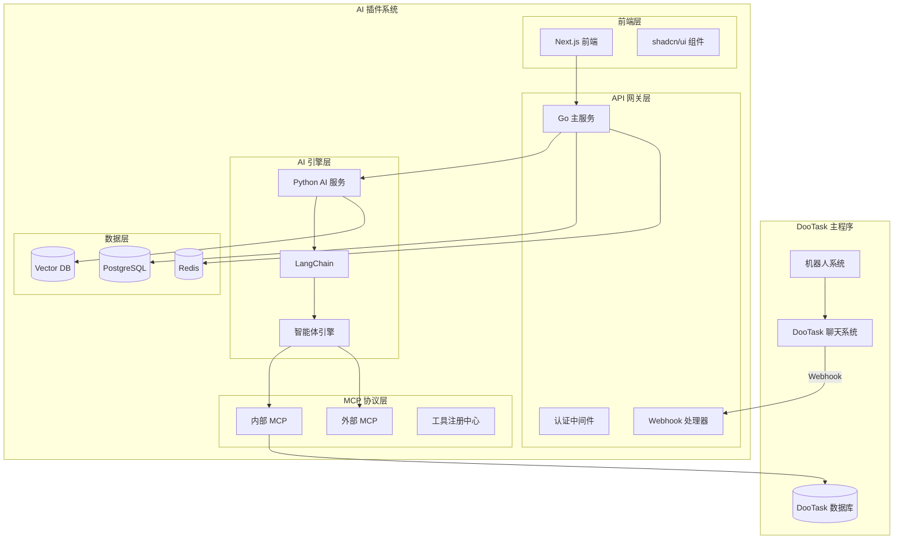
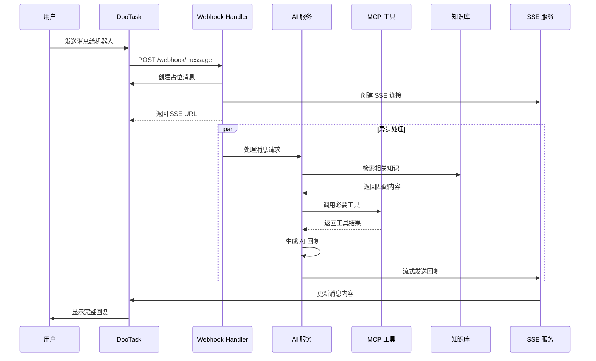

# DooTask AI 智能体插件 - 技术架构

## 🏗️ 整体架构



## 🔧 核心服务架构

### 1. Go 主服务 (API Gateway)

```go
// 主要职责
- HTTP API 路由
- WebSocket/SSE 连接管理  
- 认证和授权
- DooTask Webhook 处理
- MCP 协议实现
- 数据库操作
```

#### 目录结构
```
go-service/
├── main.go              # 主入口
├── config/              # 配置管理
├── handlers/            # HTTP 处理器
│   ├── auth.go         # 认证处理
│   ├── webhook.go      # Webhook 处理
│   ├── agent.go        # 智能体管理
│   ├── knowledge.go    # 知识库管理
│   ├── chat.go         # 聊天处理
│   └── sse.go          # SSE 通信
├── models/              # 数据模型
├── middleware/          # 中间件
├── mcp/                 # MCP 协议实现
├── services/            # 业务服务
└── utils/               # 工具函数
```

#### 核心处理流程
```go
// Webhook 处理流程
type WebhookHandler struct {
    aiService *AIService
    sseManager *SSEManager
    chatService *ChatService
}

func (h *WebhookHandler) HandleMessage(c *gin.Context) {
    // 1. 接收 DooTask webhook
    var payload WebhookPayload
    c.ShouldBindJSON(&payload)
    
    // 2. 创建占位消息
    msgID := h.chatService.CreatePlaceholderMessage(
        payload.ChatID, 
        "🤖 AI 正在思考..."
    )
    
    // 3. 异步调用 AI 服务
    go func() {
        response := h.aiService.ProcessMessage(payload)
        h.sseManager.StreamResponse(msgID, response)
    }()
    
    // 4. 返回 SSE 连接地址
    c.JSON(200, gin.H{
        "sse_url": fmt.Sprintf("/sse/chat/%s", msgID),
        "message_id": msgID,
    })
}
```

### 2. Python AI 服务

```python
# 主要职责
- AI 模型调用
- LangChain 集成
- 智能体逻辑处理
- MCP 工具调用
- 知识库向量检索
```

#### 目录结构
```
python-ai/
├── main.py              # FastAPI 主入口
├── config/              # 配置管理
├── agents/              # 智能体实现
│   ├── base_agent.py   # 基础智能体
│   ├── chat_agent.py   # 聊天智能体
│   └── task_agent.py   # 任务智能体
├── tools/               # MCP 工具实现
│   ├── dootask_tools.py # DooTask 工具
│   ├── search_tools.py  # 搜索工具
│   └── weather_tools.py # 天气工具
├── knowledge/           # 知识库处理
├── models/              # 数据模型
├── services/            # 业务服务
└── utils/               # 工具函数
```

#### 智能体实现
```python
from langchain.agents import initialize_agent
from langchain.chat_models import ChatOpenAI
from langchain.memory import ConversationBufferMemory

class DooTaskAgent:
    def __init__(self, agent_config):
        self.llm = ChatOpenAI(
            model=agent_config.model,
            temperature=agent_config.temperature
        )
        self.memory = ConversationBufferMemory()
        self.tools = self.load_tools(agent_config.tools)
        self.agent = initialize_agent(
            self.tools,
            self.llm,
            agent="chat-conversational-react-description",
            memory=self.memory
        )
    
    def process_message(self, message, context):
        # 添加上下文信息
        enhanced_message = self.enhance_with_context(message, context)
        
        # 调用智能体处理
        response = self.agent.run(enhanced_message)
        
        return response
```

### 3. MCP 协议实现

#### MCP 协议定义
```go
type MCPRequest struct {
    Jsonrpc string                 `json:"jsonrpc"`
    Method  string                 `json:"method"`
    Params  map[string]interface{} `json:"params"`
    ID      string                 `json:"id"`
}

type MCPResponse struct {
    Jsonrpc string      `json:"jsonrpc"`
    Result  interface{} `json:"result,omitempty"`
    Error   *MCPError   `json:"error,omitempty"`
    ID      string      `json:"id"`
}
```

#### 内部 MCP 工具
```go
// DooTask 内部工具集
type DooTaskMCPServer struct {
    client *DooTaskAPIClient
}

func (d *DooTaskMCPServer) GetChatMessages(params MCPParams) interface{} {
    // 获取聊天记录
    return d.client.GetMessages(params.ChatID, params.Limit)
}

func (d *DooTaskMCPServer) CreateProject(params MCPParams) interface{} {
    // 创建项目
    return d.client.CreateProject(params.ProjectData)
}

func (d *DooTaskMCPServer) CreateTask(params MCPParams) interface{} {
    // 创建任务
    return d.client.CreateTask(params.TaskData)
}
```

## 📊 数据架构

### 数据库设计

```sql
-- 智能体配置表
CREATE TABLE agents (
    id BIGSERIAL PRIMARY KEY,
    name VARCHAR(255) NOT NULL,
    description TEXT,
    prompt TEXT NOT NULL,
    model VARCHAR(100) DEFAULT 'gpt-3.5-turbo',
    temperature DECIMAL(3,2) DEFAULT 0.7,
    tools JSONB DEFAULT '[]',
    knowledge_bases JSONB DEFAULT '[]',
    created_at TIMESTAMP DEFAULT NOW(),
    updated_at TIMESTAMP DEFAULT NOW()
);

-- 对话记录表
CREATE TABLE conversations (
    id BIGSERIAL PRIMARY KEY,
    agent_id BIGINT REFERENCES agents(id),
    dootask_chat_id VARCHAR(255),
    dootask_user_id VARCHAR(255),
    context JSONB DEFAULT '{}',
    created_at TIMESTAMP DEFAULT NOW(),
    updated_at TIMESTAMP DEFAULT NOW()
);

-- 消息记录表
CREATE TABLE messages (
    id BIGSERIAL PRIMARY KEY,
    conversation_id BIGINT REFERENCES conversations(id),
    role VARCHAR(20) NOT NULL, -- 'user', 'assistant', 'system'
    content TEXT NOT NULL,
    metadata JSONB DEFAULT '{}',
    created_at TIMESTAMP DEFAULT NOW()
);

-- 知识库表
CREATE TABLE knowledge_bases (
    id BIGSERIAL PRIMARY KEY,
    name VARCHAR(255) NOT NULL,
    description TEXT,
    embedding_model VARCHAR(100) DEFAULT 'text-embedding-ada-002',
    created_at TIMESTAMP DEFAULT NOW(),
    updated_at TIMESTAMP DEFAULT NOW()
);

-- 知识库文档表
CREATE TABLE kb_documents (
    id BIGSERIAL PRIMARY KEY,
    knowledge_base_id BIGINT REFERENCES knowledge_bases(id),
    title VARCHAR(255) NOT NULL,
    content TEXT NOT NULL,
    file_path VARCHAR(500),
    embedding VECTOR(1536), -- 使用 pgvector 扩展
    metadata JSONB DEFAULT '{}',
    created_at TIMESTAMP DEFAULT NOW()
);
```

### Redis 缓存设计

```go
// 缓存键设计
const (
    // 对话上下文缓存 (TTL: 1小时)
    ConversationContextKey = "conversation:%s:context"
    
    // 智能体配置缓存 (TTL: 30分钟)
    AgentConfigKey = "agent:%d:config"
    
    // SSE 连接管理
    SSEConnectionKey = "sse:connection:%s"
    
    // MCP 工具缓存 (TTL: 10分钟)
    MCPToolsKey = "mcp:tools:%s"
)
```

## 🔄 消息流处理

### 完整的消息处理流程



## 🔒 安全架构

### 认证和授权
```go
type AuthMiddleware struct {
    jwtSecret string
    redisClient *redis.Client
}

func (a *AuthMiddleware) ValidateToken(c *gin.Context) {
    token := c.GetHeader("Authorization")
    
    // 验证 JWT Token
    claims, err := jwt.Parse(token, a.jwtSecret)
    if err != nil {
        c.JSON(401, gin.H{"error": "Invalid token"})
        return
    }
    
    // 检查用户权限
    hasPermission := a.checkPermission(claims.UserID, c.Request.URL.Path)
    if !hasPermission {
        c.JSON(403, gin.H{"error": "Insufficient permissions"})
        return
    }
    
    c.Set("user_id", claims.UserID)
    c.Next()
}
```

### 数据加密
- **传输加密**：HTTPS/TLS 1.3
- **存储加密**：数据库字段级加密
- **会话加密**：Redis 数据加密存储

## 📈 性能优化

### 缓存策略
1. **多级缓存**：Redis + 应用内存缓存
2. **智能预热**：常用智能体配置预加载
3. **过期策略**：LRU + TTL 组合策略

### 并发处理
1. **连接池**：数据库连接池优化
2. **异步处理**：AI 调用异步化
3. **限流控制**：用户级别的 QPS 限制

### 数据库优化
1. **索引优化**：针对查询模式建立复合索引
2. **分区表**：消息表按时间分区
3. **读写分离**：主从数据库架构

## 🚀 部署架构

### Docker 容器化
```yaml
# docker-compose.yml
version: '3.8'
services:
  frontend:
    build: ./frontend
    ports:
      - "3000:3000"
    
  go-service:
    build: ./backend/go-service
    ports:
      - "8080:8080"
    depends_on:
      - postgres
      - redis
    
  python-ai:
    build: ./backend/python-ai
    ports:
      - "8001:8001"
    
  postgres:
    image: pgvector/pgvector:pg15
    environment:
      POSTGRES_DB: dootask_ai
      POSTGRES_USER: dootask
      POSTGRES_PASSWORD: password
    
  redis:
    image: redis:7-alpine
```

### Kubernetes 部署
- **水平扩展**：根据负载自动扩缩容
- **服务发现**：内部服务通信优化
- **健康检查**：完整的健康检查机制
- **配置管理**：ConfigMap 和 Secret 管理

这个技术架构为 AI 智能体插件提供了强大、可扩展、安全的技术基础，支持企业级的高并发和高可用需求。 