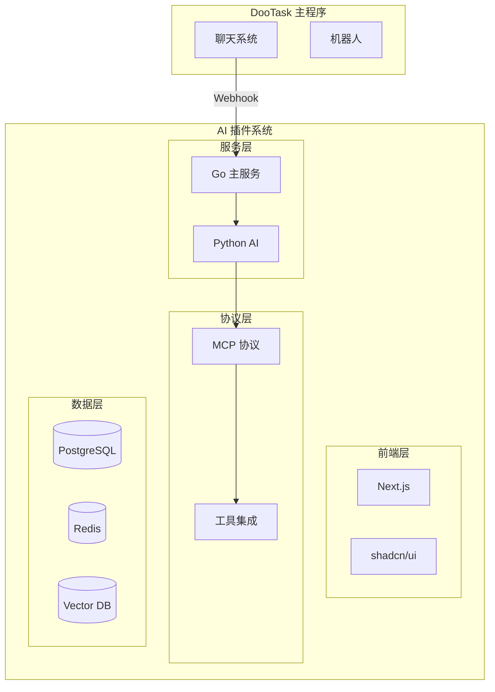

# DooTask AI 智能体插件

<div align="center">

# 🤖 DooTask AI 智能体插件

基于 **DooTask** 主程序的企业级 AI 智能体插件系统

[](https://nextjs.org/)
[](https://golang.org/)
[](https://python.org/)
[](https://langchain.com/)
[](https://typescriptlang.org/)

</div>

## ✨ 功能特性

### 🤖 多智能体管理

- **角色定制**：可视化配置 AI 角色、专业领域和能力范围
- **提示词工程**：高级提示词编辑器，支持模板和变量
- **智能体市场**：丰富的预设智能体模板库

### 🔄 实时对话系统

- **Webhook 集成**：无缝对接 DooTask 机器人系统
- **SSE 实时更新**：流式 AI 回复，用户体验流畅
- **上下文管理**：智能维护对话历史和上下文

### 🛠️ MCP 协议集成

- **内部工具**：深度集成 DooTask 功能（聊天记录、项目管理、任务分配）
- **外部工具**：支持天气查询、网页搜索、邮件发送等第三方服务
- **工具权限**：精细化控制不同智能体的工具访问权限

### 📚 知识库系统

- **多格式支持**：PDF、Word、Excel、Markdown 等文档格式
- **向量化检索**：基于 AI Embedding 的语义搜索
- **版本控制**：完整的知识库版本管理机制

### 🏢 企业级特性

- **多租户支持**：支持多个企业独立使用
- **权限管理**：基于角色的精细访问控制
- **审计日志**：完整的操作和对话审计追踪
- **数据安全**：端到端加密和隐私保护

## 🏗️ 技术架构



### 核心技术栈

#### 前端技术

- **[Next.js 15](https://nextjs.org/)** - React 全栈框架
- **[shadcn/ui](https://ui.shadcn.com/)** - 现代化组件库
- **[Tailwind CSS](https://tailwindcss.com/)** - 原子化 CSS 框架
- **[TypeScript](https://typescriptlang.org/)** - 类型安全的 JavaScript

#### 后端技术

- **[Go](https://golang.org/)** - 高性能 API 网关服务
- **[Python](https://python.org/)** - AI 引擎和 LangChain 服务
- **[LangChain](https://langchain.com/)** - AI 应用开发框架
- **[PostgreSQL](https://postgresql.org/)** - 主数据库（支持向量搜索）
- **[Redis](https://redis.io/)** - 缓存和会话存储

## 🚀 快速开始

### 环境要求

- Node.js 22+
- Go 1.21+
- Python 3.11+
- Docker & Docker Compose

### 一键启动

```bash
# 克隆项目
git clone https://github.com/dootask/ai.git
cd ai

# 快速启动（推荐）
npm run quick-start
```

### 手动安装

```bash
# 1. 安装前端依赖
npm install

# 2. 复制环境配置
cp config.example.env .env
# 编辑 .env 文件，填入 OpenAI API Key 等配置

# 3. 启动数据库服务
npm run db:up

# 4. 初始化数据库
docker exec -i dootask-ai-postgres psql -U dootask -d dootask_ai < scripts/init.sql

# 5. 启动前端开发服务器
npm run dev
```

### 访问应用

- **前端界面**: http://localhost:3000
- **API 文档**: http://localhost:8080/swagger (开发中)
- **数据库**: PostgreSQL (localhost:5432)

## 📖 使用指南

### 配置智能体

1. 访问 [智能体管理页面](http://localhost:3000/agents)
2. 点击"创建智能体"按钮
3. 配置智能体信息：
   - **名称和描述**：定义智能体的基本信息
   - **角色提示词**：设置 AI 的角色和行为模式
   - **模型选择**：选择 GPT-3.5、GPT-4 等模型
   - **工具权限**：选择智能体可以使用的工具
   - **知识库绑定**：关联相关的知识库

### 集成 DooTask 机器人

1. 在 DooTask 中创建机器人
2. 配置机器人的 Webhook 地址：`http://your-domain/api/webhook/message`
3. 在插件中绑定机器人 ID 和智能体
4. 开始在 DooTask 中与 AI 智能体对话

### 管理知识库

1. 访问 [知识库管理页面](http://localhost:3000/knowledge)
2. 创建知识库并上传文档
3. 系统自动进行文档解析和向量化
4. 将知识库绑定到相应的智能体

## 🛠️ 开发指南

### 项目结构

```
dootask-ai/                 # Next.js 前端项目根目录
├── app/                    # Next.js App Router 页面
├── components/             # 共享 React 组件
├── lib/                   # 前端工具库和 API 接口
├── public/                # 静态资源文件
├── backend/               # 后端服务
│   ├── go-service/        # Go 主服务
│   └── python-ai/         # Python AI 服务
├── mcp-tools/             # MCP 工具集
├── docker/                # Docker 配置
├── scripts/               # 部署和初始化脚本
├── docs/                  # 项目文档
├── package.json           # Node.js 依赖配置
└── next.config.ts         # Next.js 配置文件
```

### 开发命令

```bash
# 前端开发
npm run dev              # 启动开发服务器
npm run build           # 构建生产版本
npm run lint            # 代码检查
npm run format          # 代码格式化

# 数据库管理
npm run db:up           # 启动数据库
npm run db:down         # 停止数据库
npm run db:reset        # 重置数据库

# 日志查看
npm run logs:go         # Go 服务日志
npm run logs:python     # Python 服务日志
npm run logs:db         # 数据库日志
```

### 扩展开发

#### 添加新的 MCP 工具

1. 在 `mcp-tools/` 目录创建工具定义
2. 实现工具的接口和逻辑
3. 在智能体配置中启用该工具

#### 自定义智能体类型

1. 在 `backend/python-ai/agents/` 目录添加智能体类
2. 继承 `BaseAgent` 并实现特定逻辑
3. 在前端添加对应的配置界面

## 📚 文档链接

- [项目规划](./docs/PROJECT_PLAN.md) - 完整的项目规划和发展路线图
- [技术架构](./docs/ARCHITECTURE.md) - 详细的技术架构设计文档
- [开发指南](./docs/DEVELOPMENT.md) - 开发环境搭建和编码规范
- [部署指南](./docs/DEPLOYMENT.md) - 生产环境部署说明 (开发中)

## 🤝 贡献指南

我们欢迎所有形式的贡献！

### 如何贡献

1. Fork 本项目
2. 创建特性分支 (`git checkout -b feature/AmazingFeature`)
3. 提交更改 (`git commit -m 'Add some AmazingFeature'`)
4. 推送到分支 (`git push origin feature/AmazingFeature`)
5. 创建 Pull Request

### 开发规范

- 遵循 [代码规范](./docs/DEVELOPMENT.md#代码规范)
- 编写测试用例
- 更新相关文档
- 确保 CI 通过

## 📄 开源协议

本项目基于 [MIT 协议](./LICENSE) 开源。

## 🙏 致谢

感谢以下开源项目的贡献：

- [Next.js](https://nextjs.org/) - React 全栈框架
- [LangChain](https://langchain.com/) - AI 应用开发框架
- [shadcn/ui](https://ui.shadcn.com/) - 现代化 UI 组件库
- [OpenAI](https://openai.com/) - 强大的 AI 模型支持

## 📞 联系我们

- 项目主页：[https://github.com/dootask/ai](https://github.com/dootask/ai)
- 问题反馈：[Issues](https://github.com/dootask/ai/issues)
- 功能建议：[Discussions](https://github.com/dootask/ai/discussions)

---

<div align="center">
  Made with ❤️ by <a href="https://dootask.com">DooTask Team</a>
</div>
