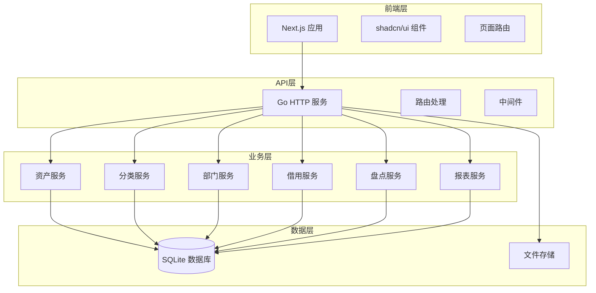

# 企业固定资产管理系统

<div align="center">

# 📦 企业固定资产管理系统

基于 **Next.js** 和 **Go** 的轻量级企业固定资产管理解决方案

[](https://nextjs.org/)
[](https://golang.org/)
[](https://sqlite.org/)
[](https://typescriptlang.org/)

</div>

## ✨ 功能特性

### 📦 资产管理

- **资产登记**：完整的资产信息录入和管理
- **分类管理**：灵活的树形分类体系
- **状态跟踪**：实时跟踪资产状态变化
- **图片管理**：支持资产图片上传和展示

### 🏢 部门管理

- **部门架构**：完整的部门信息管理
- **责任人管理**：明确资产使用责任归属
- **部门统计**：按部门统计资产分布情况

### 📋 借用管理

- **借用申请**：规范化的资产借用流程
- **归还管理**：便捷的资产归还处理
- **超期提醒**：自动识别和提醒超期资产
- **借用历史**：完整的借用记录追踪

### 📊 盘点管理

- **盘点任务**：灵活的盘点任务创建和管理
- **盘点执行**：支持扫码和手动录入的盘点方式
- **差异处理**：自动识别盘盈盘亏情况
- **盘点报告**：详细的盘点结果统计分析

### 📈 报表统计

- **多维统计**：按分类、部门、状态等维度统计
- **图表展示**：直观的图表数据可视化
- **报表导出**：支持Excel格式报表导出
- **实时仪表板**：关键指标实时监控

## 🏗️ 技术架构



### 核心技术栈

#### 前端技术

- **[Next.js 15](https://nextjs.org/)** - React 全栈框架
- **[shadcn/ui](https://ui.shadcn.com/)** - 现代化组件库
- **[Tailwind CSS](https://tailwindcss.com/)** - 原子化 CSS 框架
- **[TypeScript](https://typescriptlang.org/)** - 类型安全的 JavaScript

#### 后端技术

- **[Go](https://golang.org/)** - 高性能 HTTP 服务
- **[Gin](https://gin-gonic.com/)** - Web 框架
- **[GORM](https://gorm.io/)** - ORM 框架
- **[SQLite](https://sqlite.org/)** - 轻量级数据库

## 🚀 快速开始

### 环境要求

- Node.js 22+
- Go 1.21+

### 一键启动

```bash
# 克隆项目
git clone https://github.com/asset-management/system.git
cd system

# 安装前端依赖
npm install

# 启动前端开发服务器
npm run dev

# 启动后端服务器（新终端）
cd server
go run main.go
```

### 访问应用

- **前端界面**: http://localhost:3000
- **后端API**: http://localhost:8000
- **数据库**: SQLite (./data/assets.db)

## 📖 使用指南

### 资产管理

1. 访问 [资产管理页面](http://localhost:3000/assets)
2. 点击"新增资产"按钮
3. 填写资产信息：
   - **基本信息**：资产编号、名称、品牌型号等
   - **分类信息**：选择资产分类
   - **部门信息**：指定使用部门和责任人
   - **采购信息**：采购日期、价格、供应商等
   - **图片上传**：上传资产照片

### 借用管理

1. 访问 [借用管理页面](http://localhost:3000/borrow)
2. 点击"新增借用"申请借用资产
3. 填写借用信息：
   - **借用人信息**：姓名、联系方式、部门
   - **借用资产**：选择可借用的资产
   - **借用期限**：预计归还时间
4. 归还时点击"归还"按钮完成归还流程

### 盘点管理

1. 访问 [盘点管理页面](http://localhost:3000/inventory)
2. 创建盘点任务并设置盘点范围
3. 执行盘点：
   - **扫码盘点**：使用资产编号扫码
   - **手动录入**：手动输入资产编号
   - **记录差异**：标记盘盈盘亏情况
4. 生成盘点报告并分析结果

## 🛠️ 开发指南

### 项目结构

```
asset-management-system/    # 项目根目录
├── app/                    # Next.js App Router 页面
├── components/             # 共享 React 组件
├── lib/                   # 前端工具库和 API 接口
├── public/                # 静态资源文件
├── server/                # Go 后端服务
│   ├── cmd/               # 命令行入口
│   ├── database/          # 数据库连接
│   ├── middleware/        # 中间件
│   ├── migrations/        # 数据库迁移
│   ├── pkg/               # 工具包
│   ├── routes/            # 路由处理
│   └── main.go           # 服务入口
├── scripts/               # 部署和初始化脚本
├── docs/                  # 项目文档
├── package.json           # Node.js 依赖配置
└── next.config.ts         # Next.js 配置文件
```

### 开发命令

```bash
# 安装前端依赖
npm install

# 启动前端开发服务器
npm run dev

# 启动后端服务器
cd server
go run main.go
```

### 扩展开发

#### 添加新的资产字段

1. 在数据库迁移中添加字段定义
2. 更新 Go 结构体和 API 接口
3. 在前端表单中添加对应的输入组件

#### 自定义报表类型

1. 在 `server/routes/api/reports/` 目录添加报表处理器
2. 实现报表数据查询和统计逻辑
3. 在前端添加对应的报表展示页面

## 📚 文档链接

- [技术架构](./docs/ARCHITECTURE.md) - 详细的技术架构设计文档
- [开发指南](./docs/DEVELOPMENT.md) - 开发环境搭建和编码规范
- [部署指南](./docs/DEPLOYMENT.md) - 生产环境部署说明
- [API 标准](./docs/API_STANDARDS.md) - API 接口设计规范

## 🤝 贡献指南

我们欢迎所有形式的贡献！

### 如何贡献

1. Fork 本项目
2. 创建特性分支 (`git checkout -b feature/AmazingFeature`)
3. 提交更改 (`git commit -m 'Add some AmazingFeature'`)
4. 推送到分支 (`git push origin feature/AmazingFeature`)
5. 创建 Pull Request

### 开发规范

- 遵循 [代码规范](./docs/DEVELOPMENT.md#代码规范)
- 编写测试用例
- 更新相关文档
- 确保 CI 通过

## 📄 开源协议

本项目基于 [MIT 协议](./LICENSE) 开源。

## 🙏 致谢

感谢以下开源项目的贡献：

- [Next.js](https://nextjs.org/) - React 全栈框架
- [Go](https://golang.org/) - 高性能后端语言
- [shadcn/ui](https://ui.shadcn.com/) - 现代化 UI 组件库
- [SQLite](https://sqlite.org/) - 轻量级数据库

## 📞 联系我们

- 项目主页：[https://github.com/asset-management/system](https://github.com/asset-management/system)
- 问题反馈：[Issues](https://github.com/asset-management/system/issues)
- 功能建议：[Discussions](https://github.com/asset-management/system/discussions)

---

<div align="center">
  Made with ❤️ by Asset Management Team
</div>
