# 企业固定资产管理系统

<div align="center">

# 📦 企业固定资产管理系统

基于 **Next.js** 和 **Go** 的轻量级企业固定资产管理解决方案

[](https://nextjs.org/)
[](https://golang.org/)
[](https://sqlite.org/)
[](https://typescriptlang.org/)

</div>

## ✨ 功能特性

### 📦 资产管理

- **资产登记**：完整的资产信息录入和管理
- **分类管理**：灵活的树形分类体系
- **状态跟踪**：实时跟踪资产状态变化
- **图片管理**：支持资产图片上传和展示

### 🏢 部门管理

- **部门架构**：完整的部门信息管理
- **责任人管理**：明确资产使用责任归属
- **部门统计**：按部门统计资产分布情况

### 📋 借用管理

- **借用申请**：规范化的资产借用流程
- **归还管理**：便捷的资产归还处理
- **超期提醒**：自动识别和提醒超期资产
- **借用历史**：完整的借用记录追踪

### 📊 盘点管理

- **盘点任务**：灵活的盘点任务创建和管理
- **盘点执行**：支持扫码和手动录入的盘点方式
- **差异处理**：自动识别盘盈盘亏情况
- **盘点报告**：详细的盘点结果统计分析

### 📈 报表统计

- **多维统计**：按分类、部门、状态等维度统计
- **图表展示**：直观的图表数据可视化
- **报表导出**：支持Excel格式报表导出
- **实时仪表板**：关键指标实时监控

## 🏗️ 技术架构

```mermaid
graph TB
    subgraph "前端层"
        UI[Next.js 应用]
        COMP[shadcn/ui 组件]
        PAGES[页面路由]
    end

    subgraph "API层"
        GO[Go HTTP 服务]
        ROUTER[路由处理]
        MIDDLEWARE[中间件]
    end

    subgraph "业务层"
        ASSET[资产服务]
        CATEGORY[分类服务]
        DEPT[部门服务]
        BORROW[借用服务]
        INVENTORY[盘点服务]
        REPORT[报表服务]
    end

    subgraph "数据层"
        SQLITE[(SQLite 数据库)]
        FILES[文件存储]
    end

    UI --> GO
    GO --> ASSET
    GO --> CATEGORY
    GO --> DEPT
    GO --> BORROW
    GO --> INVENTORY
    GO --> REPORT
    ASSET --> SQLITE
    CATEGORY --> SQLITE
    DEPT --> SQLITE
    BORROW --> SQLITE
    INVENTORY --> SQLITE
    REPORT --> SQLITE
    GO --> FILES
```



### 核心技术栈

#### 前端技术

- **[Next.js 15](https://nextjs.org/)** - React 全栈框架
- **[shadcn/ui](https://ui.shadcn.com/)** - 现代化组件库
- **[Tailwind CSS](https://tailwindcss.com/)** - 原子化 CSS 框架
- **[TypeScript](https://typescriptlang.org/)** - 类型安全的 JavaScript

#### 后端技术

- **[Go](https://golang.org/)** - 高性能 HTTP 服务
- **[Gin](https://gin-gonic.com/)** - Web 框架
- **[GORM](https://gorm.io/)** - ORM 框架
- **[SQLite](https://sqlite.org/)** - 轻量级数据库

## 🚀 快速开始

### 环境要求

- Node.js 22+
- Go 1.21+

### 一键启动

```bash
# 克隆项目
git clone https://github.com/dootask/assets.git
cd assets

# 安装前后端依赖
make install

# 启动后端服务和前端开发服务器
make dev
```

### 访问应用

- **前端界面**: http://localhost:3000
- **后端API**: http://localhost:8000
- **数据库**: SQLite (./data/assets.db)

## 🛠️ 开发指南

### 项目结构

```
asset-management-system/    # 项目根目录
├── app/                    # Next.js App Router 页面
├── components/             # 共享 React 组件
├── lib/                   # 前端工具库和 API 接口
├── public/                # 静态资源文件
├── server/                # Go 后端服务
│   ├── cmd/               # 命令行入口
│   ├── database/          # 数据库连接
│   ├── middleware/        # 中间件
│   ├── migrations/        # 数据库迁移
│   ├── pkg/               # 工具包
│   ├── routes/            # 路由处理
│   └── main.go           # 服务入口
├── scripts/               # 部署和初始化脚本
├── docs/                  # 项目文档
├── package.json           # Node.js 依赖配置
└── next.config.ts         # Next.js 配置文件
```

## 🤝 贡献指南

我们欢迎所有形式的贡献！

### 如何贡献

1. Fork 本项目
2. 创建特性分支 (`git checkout -b feature/AmazingFeature`)
3. 提交更改 (`git commit -m 'Add some AmazingFeature'`)
4. 推送到分支 (`git push origin feature/AmazingFeature`)
5. 创建 Pull Request

### 开发规范

- 遵循 [代码规范](./docs/DEVELOPMENT.md#代码规范)
- 编写测试用例
- 更新相关文档
- 确保 CI 通过

## 📄 开源协议

本项目基于 [MIT 协议](./LICENSE) 开源。

## 🙏 致谢

感谢以下开源项目的贡献：

- [Next.js](https://nextjs.org/) - React 全栈框架
- [Go](https://golang.org/) - 高性能后端语言
- [shadcn/ui](https://ui.shadcn.com/) - 现代化 UI 组件库
- [SQLite](https://sqlite.org/) - 轻量级数据库

## 📞 联系我们

- 项目主页：[https://github.com/dootask/assets](https://github.com/dootask/assets)
- 问题反馈：[Issues](https://github.com/dootask/assets/issues)

---

<div align="center">
  Made with ❤️ by DooTask Team
</div>
