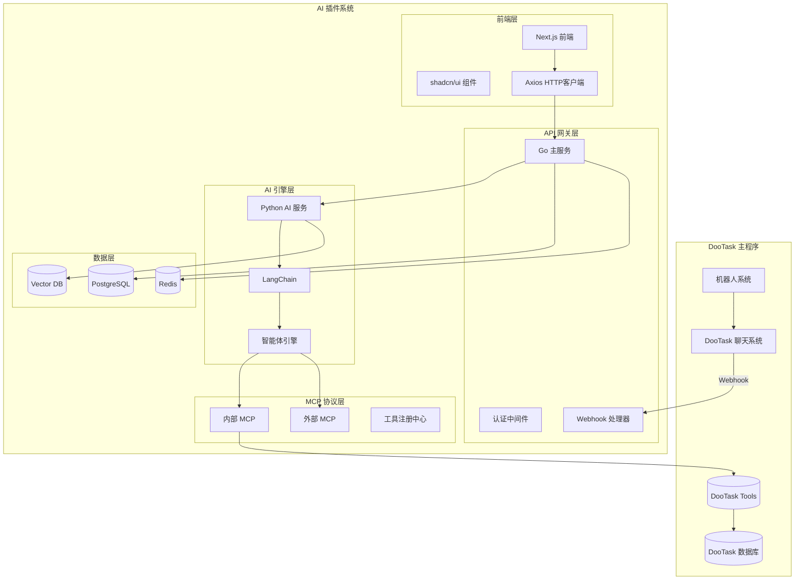
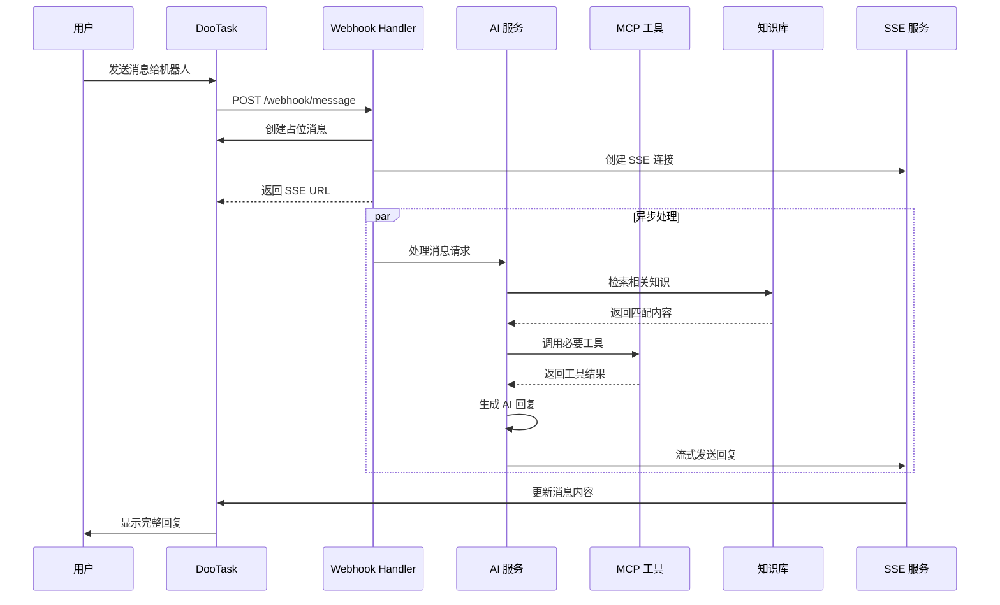

# DooTask AI 智能体插件 - 技术架构

## 🏗️ 整体架构



## 🔧 核心服务架构

### 1. Go 主服务 (API Gateway)

```go
// 主要职责
- HTTP API 路由
- WebSocket/SSE 连接管理  
- 认证和授权
- DooTask Webhook 处理
- MCP 协议实现
- 数据库操作
```

#### 目录结构
```
go-service/
├── main.go              # 主入口
├── config/              # 配置管理
├── handlers/            # HTTP 处理器
│   ├── auth.go         # 认证处理
│   ├── webhook.go      # Webhook 处理
│   ├── agent.go        # 智能体管理
│   ├── knowledge.go    # 知识库管理
│   ├── chat.go         # 聊天处理
│   └── sse.go          # SSE 通信
├── models/              # 数据模型
├── middleware/          # 中间件
├── mcp/                 # MCP 协议实现
├── services/            # 业务服务
└── utils/               # 工具函数
```

#### 核心处理流程
```go
// Webhook 处理流程
type WebhookHandler struct {
    aiService *AIService
    sseManager *SSEManager
    chatService *ChatService
}

func (h *WebhookHandler) HandleMessage(c *gin.Context) {
    // 1. 接收 DooTask webhook
    var payload WebhookPayload
    c.ShouldBindJSON(&payload)
    
    // 2. 创建占位消息
    msgID := h.chatService.CreatePlaceholderMessage(
        payload.ChatID, 
        "🤖 AI 正在思考..."
    )
    
    // 3. 异步调用 AI 服务
    go func() {
        response := h.aiService.ProcessMessage(payload)
        h.sseManager.StreamResponse(msgID, response)
    }()
    
    // 4. 返回 SSE 连接地址
    c.JSON(200, gin.H{
        "sse_url": fmt.Sprintf("/sse/chat/%s", msgID),
        "message_id": msgID,
    })
}
```

### 2. Python AI 服务

```python
# 主要职责
- AI 模型调用
- LangChain 集成
- 智能体逻辑处理
- MCP 工具调用
- 知识库向量检索
```

#### 目录结构
```
python-ai/
├── main.py              # FastAPI 主入口
├── config/              # 配置管理
├── agents/              # 智能体实现
│   ├── base_agent.py   # 基础智能体
│   ├── chat_agent.py   # 聊天智能体
│   └── task_agent.py   # 任务智能体
├── tools/               # MCP 工具实现
│   ├── dootask_tools.py # DooTask 工具
│   ├── search_tools.py  # 搜索工具
│   └── weather_tools.py # 天气工具
├── knowledge/           # 知识库处理
├── models/              # 数据模型
├── services/            # 业务服务
└── utils/               # 工具函数
```

#### 智能体实现
```python
from langchain.agents import initialize_agent
from langchain.chat_models import ChatOpenAI
from langchain.memory import ConversationBufferMemory

class DooTaskAgent:
    def __init__(self, agent_config):
        self.llm = ChatOpenAI(
            model=agent_config.model,
            temperature=agent_config.temperature
        )
        self.memory = ConversationBufferMemory()
        self.tools = self.load_tools(agent_config.tools)
        self.agent = initialize_agent(
            self.tools,
            self.llm,
            agent="chat-conversational-react-description",
            memory=self.memory
        )
    
    def process_message(self, message, context):
        # 添加上下文信息
        enhanced_message = self.enhance_with_context(message, context)
        
        # 调用智能体处理
        response = self.agent.run(enhanced_message)
        
        return response
```

### 3. MCP 协议实现

#### MCP 协议定义
```go
type MCPRequest struct {
    Jsonrpc string                 `json:"jsonrpc"`
    Method  string                 `json:"method"`
    Params  map[string]interface{} `json:"params"`
    ID      string                 `json:"id"`
}

type MCPResponse struct {
    Jsonrpc string      `json:"jsonrpc"`
    Result  interface{} `json:"result,omitempty"`
    Error   *MCPError   `json:"error,omitempty"`
    ID      string      `json:"id"`
}
```

#### 内部 MCP 工具

使用官方 [dootask-tools](https://github.com/dootask/tools/blob/main/server/python/README.md) Python 包：

```python
# 安装依赖
# pip install dootask-tools

from mcp import Server
from mcp import types
from dootask_tools import DooTaskClient
import os
import asyncio

class DooTaskMCPServer:
    def __init__(self):
        self.client = DooTaskClient(
            base_url=os.getenv("DOOTASK_API_URL"),
            token=os.getenv("DOOTASK_API_TOKEN")
        )
    
    async def get_chat_messages(self, chat_id: str, limit: int = 50):
        """获取聊天记录"""
        return await self.client.chat.get_messages(chat_id, limit=limit)
    
    async def create_project(self, name: str, description: str = "", owner_id: str = ""):
        """创建项目"""
        return await self.client.project.create(
            name=name,
            description=description,
            owner_id=owner_id
        )
    
    async def create_task(self, title: str, project_id: str, assignee_id: str, 
                         description: str = "", priority: str = "medium"):
        """创建任务"""
        return await self.client.task.create(
            title=title,
            description=description,
            project_id=project_id,
            assignee_id=assignee_id,
            priority=priority
        )
    
    async def get_user_info(self, user_id: str):
        """获取用户信息"""
        return await self.client.user.get(user_id)
    
    async def search_tasks(self, query: str, project_id: str = "", status: str = ""):
        """搜索任务"""
        return await self.client.task.search(
            query=query,
            project_id=project_id,
            status=status
        )
    
    async def send_message(self, chat_id: str, content: str, type: str = "text"):
        """发送消息"""
        return await self.client.chat.send_message(
            chat_id=chat_id,
            content=content,
            type=type
        )

# MCP 服务器实现
async def serve_dootask_mcp():
    server = Server("dootask-internal")
    dootask_server = DooTaskMCPServer()
    
    @server.list_tools()
    async def handle_list_tools() -> list[types.Tool]:
        return [
            types.Tool(
                name="get_chat_messages",
                description="获取指定聊天的消息记录",
                inputSchema={
                    "type": "object",
                    "properties": {
                        "chat_id": {"type": "string", "description": "聊天ID"},
                        "limit": {"type": "integer", "description": "消息数量限制", "default": 50}
                    },
                    "required": ["chat_id"]
                }
            ),
            types.Tool(
                name="create_project",
                description="创建新项目",
                inputSchema={
                    "type": "object",
                    "properties": {
                        "name": {"type": "string", "description": "项目名称"},
                        "description": {"type": "string", "description": "项目描述"},
                        "owner_id": {"type": "string", "description": "项目负责人ID"}
                    },
                    "required": ["name"]
                }
            ),
            types.Tool(
                name="create_task",
                description="创建新任务",
                inputSchema={
                    "type": "object",
                    "properties": {
                        "title": {"type": "string", "description": "任务标题"},
                        "description": {"type": "string", "description": "任务描述"},
                        "project_id": {"type": "string", "description": "所属项目ID"},
                        "assignee_id": {"type": "string", "description": "执行人ID"},
                        "priority": {"type": "string", "enum": ["low", "medium", "high"], "default": "medium"}
                    },
                    "required": ["title", "project_id", "assignee_id"]
                }
            ),
            types.Tool(
                name="search_tasks",
                description="搜索任务",
                inputSchema={
                    "type": "object",
                    "properties": {
                        "query": {"type": "string", "description": "搜索关键词"},
                        "project_id": {"type": "string", "description": "项目ID过滤"},
                        "status": {"type": "string", "description": "任务状态过滤"}
                    },
                    "required": ["query"]
                }
            ),
            types.Tool(
                name="send_message",
                description="发送消息到指定聊天",
                inputSchema={
                    "type": "object",
                    "properties": {
                        "chat_id": {"type": "string", "description": "聊天ID"},
                        "content": {"type": "string", "description": "消息内容"},
                        "type": {"type": "string", "enum": ["text", "markdown"], "default": "text"}
                    },
                    "required": ["chat_id", "content"]
                }
            )
        ]
    
    @server.call_tool()
    async def handle_call_tool(name: str, arguments: dict) -> list[types.TextContent]:
        try:
            if name == "get_chat_messages":
                result = await dootask_server.get_chat_messages(**arguments)
                return [types.TextContent(type="text", text=f"聊天记录: {result}")]
            elif name == "create_project":
                result = await dootask_server.create_project(**arguments)
                return [types.TextContent(type="text", text=f"项目创建成功: {result}")]
            elif name == "create_task":
                result = await dootask_server.create_task(**arguments)
                return [types.TextContent(type="text", text=f"任务创建成功: {result}")]
            elif name == "search_tasks":
                result = await dootask_server.search_tasks(**arguments)
                return [types.TextContent(type="text", text=f"任务搜索结果: {result}")]
            elif name == "send_message":
                result = await dootask_server.send_message(**arguments)
                return [types.TextContent(type="text", text=f"消息发送成功: {result}")]
            else:
                raise ValueError(f"Unknown tool: {name}")
        except Exception as e:
            return [types.TextContent(type="text", text=f"工具调用失败: {str(e)}")]
    
    return server

# 启动 MCP 服务器
if __name__ == "__main__":
    import asyncio
    from mcp.server.stdio import stdio_server
    
    async def main():
        server = await serve_dootask_mcp()
        async with stdio_server() as (read_stream, write_stream):
            await server.run(
                read_stream,
                write_stream,
                InitializationOptions(
                    server_name="dootask-internal",
                    server_version="1.0.0"
                )
            )
    
    asyncio.run(main())
```

## 📊 数据架构

### 数据库设计

```sql
-- 智能体配置表
CREATE TABLE agents (
    id BIGSERIAL PRIMARY KEY,
    name VARCHAR(255) NOT NULL,
    description TEXT,
    prompt TEXT NOT NULL,
    model VARCHAR(100) DEFAULT 'gpt-3.5-turbo',
    temperature DECIMAL(3,2) DEFAULT 0.7,
    tools JSONB DEFAULT '[]',
    knowledge_bases JSONB DEFAULT '[]',
    created_at TIMESTAMP DEFAULT NOW(),
    updated_at TIMESTAMP DEFAULT NOW()
);

-- 对话记录表
CREATE TABLE conversations (
    id BIGSERIAL PRIMARY KEY,
    agent_id BIGINT REFERENCES agents(id),
    dootask_chat_id VARCHAR(255),
    dootask_user_id VARCHAR(255),
    context JSONB DEFAULT '{}',
    created_at TIMESTAMP DEFAULT NOW(),
    updated_at TIMESTAMP DEFAULT NOW()
);

-- 消息记录表
CREATE TABLE messages (
    id BIGSERIAL PRIMARY KEY,
    conversation_id BIGINT REFERENCES conversations(id),
    role VARCHAR(20) NOT NULL, -- 'user', 'assistant', 'system'
    content TEXT NOT NULL,
    metadata JSONB DEFAULT '{}',
    created_at TIMESTAMP DEFAULT NOW()
);

-- 知识库表
CREATE TABLE knowledge_bases (
    id BIGSERIAL PRIMARY KEY,
    name VARCHAR(255) NOT NULL,
    description TEXT,
    embedding_model VARCHAR(100) DEFAULT 'text-embedding-ada-002',
    created_at TIMESTAMP DEFAULT NOW(),
    updated_at TIMESTAMP DEFAULT NOW()
);

-- 知识库文档表
CREATE TABLE kb_documents (
    id BIGSERIAL PRIMARY KEY,
    knowledge_base_id BIGINT REFERENCES knowledge_bases(id),
    title VARCHAR(255) NOT NULL,
    content TEXT NOT NULL,
    file_path VARCHAR(500),
    embedding VECTOR(1536), -- 使用 pgvector 扩展
    metadata JSONB DEFAULT '{}',
    created_at TIMESTAMP DEFAULT NOW()
);
```

### Redis 缓存设计

```go
// 缓存键设计
const (
    // 对话上下文缓存 (TTL: 1小时)
    ConversationContextKey = "conversation:%s:context"
    
    // 智能体配置缓存 (TTL: 30分钟)
    AgentConfigKey = "agent:%d:config"
    
    // SSE 连接管理
    SSEConnectionKey = "sse:connection:%s"
    
    // MCP 工具缓存 (TTL: 10分钟)
    MCPToolsKey = "mcp:tools:%s"
)
```

## 🔄 消息流处理

### 完整的消息处理流程



## 🔒 安全架构

### 认证和授权
```go
type AuthMiddleware struct {
    jwtSecret string
    redisClient *redis.Client
}

func (a *AuthMiddleware) ValidateToken(c *gin.Context) {
    token := c.GetHeader("Authorization")
    
    // 验证 JWT Token
    claims, err := jwt.Parse(token, a.jwtSecret)
    if err != nil {
        c.JSON(http.StatusUnauthorized, APIError{
            Code:    "AUTH_001",
            Message: "Invalid token",
            Data:    nil,
        })
        return
    }
    
    // 检查用户权限
    hasPermission := a.checkPermission(claims.UserID, c.Request.URL.Path)
    if !hasPermission {
        c.JSON(http.StatusForbidden, APIError{
            Code:    "AUTH_003",
            Message: "Insufficient permissions",
            Data:    nil,
        })
        return
    }
    
    c.Set("user_id", claims.UserID)
    c.Next()
}
```

### 数据加密
- **传输加密**：HTTPS/TLS 1.3
- **存储加密**：数据库字段级加密
- **会话加密**：Redis 数据加密存储

## 📈 性能优化

### 缓存策略
1. **多级缓存**：Redis + 应用内存缓存
2. **智能预热**：常用智能体配置预加载
3. **过期策略**：LRU + TTL 组合策略

### 并发处理
1. **连接池**：数据库连接池优化
2. **异步处理**：AI 调用异步化
3. **限流控制**：用户级别的 QPS 限制

### 数据库优化
1. **索引优化**：针对查询模式建立复合索引
2. **分区表**：消息表按时间分区
3. **读写分离**：主从数据库架构

## 🚀 部署架构

### Docker 容器化
```yaml
# docker-compose.yml
version: '3.8'
services:
  frontend:
    build: ./frontend
    ports:
      - "3000:3000"
    
  go-service:
    build: ./backend/go-service
    ports:
      - "8080:8080"
    depends_on:
      - postgres
      - redis
    
  python-ai:
    build: ./backend/python-ai
    ports:
      - "8001:8001"
    
  postgres:
    image: pgvector/pgvector:pg15
    environment:
      POSTGRES_DB: dootask_ai
      POSTGRES_USER: dootask
      POSTGRES_PASSWORD: password
    
  redis:
    image: redis:7-alpine
```

这个技术架构为 AI 智能体插件提供了强大、可扩展、安全的技术基础，支持企业级的高并发和高可用需求。 