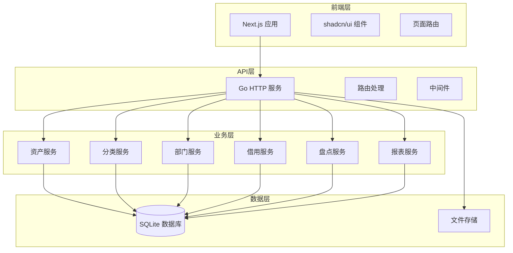
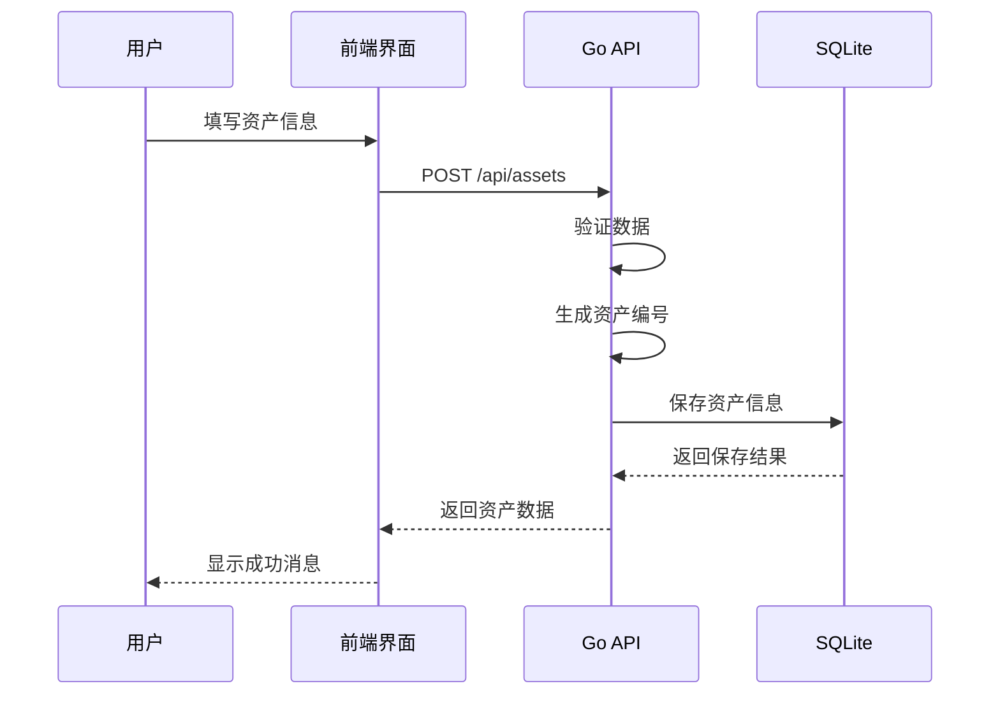
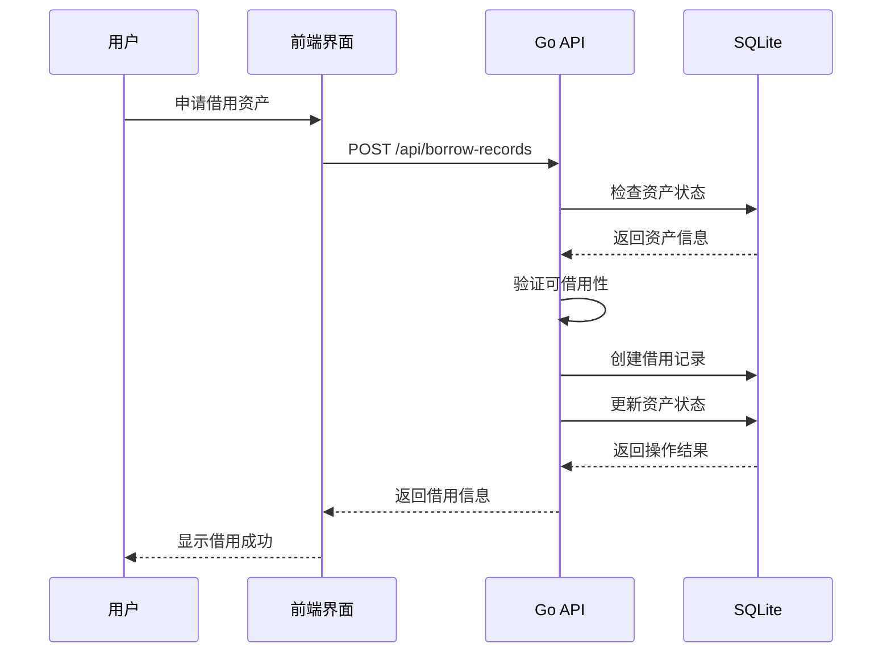

# 企业固定资产管理系统 - 技术架构

## 🏗️ 整体架构



## 🔧 核心服务架构

### 1. Go HTTP 服务

```go
// 主要职责
- HTTP API 路由
- 业务逻辑处理
- 数据库操作
- 文件上传管理
- 报表生成
```

#### 目录结构

```
server/
├── main.go              # 主入口
├── cmd/                 # 命令行工具
├── database/            # 数据库连接
├── global/              # 全局变量
├── middleware/          # 中间件
├── migrations/          # 数据库迁移
├── pkg/                 # 工具包
│   ├── jwt/            # JWT 认证
│   └── utils/          # 工具函数
└── routes/             # 路由处理
    ├── api/            # API 路由
    │   ├── dashboard/  # 仪表板
    │   └── test/       # 测试
    └── health/         # 健康检查
```

#### 核心处理流程

```go
// 资产管理处理流程
type AssetHandler struct {
    db *gorm.DB
}

func (h *AssetHandler) CreateAsset(c *gin.Context) {
    var asset Asset
    if err := c.ShouldBindJSON(&asset); err != nil {
        c.JSON(http.StatusBadRequest, gin.H{"error": err.Error()})
        return
    }

    // 生成资产编号
    asset.AssetNo = generateAssetNumber()

    // 保存到数据库
    if err := h.db.Create(&asset).Error; err != nil {
        c.JSON(http.StatusInternalServerError, gin.H{"error": err.Error()})
        return
    }

    c.JSON(http.StatusOK, asset)
}
```

## 📊 数据架构

### 数据库设计

```sql
-- 资产分类表
CREATE TABLE categories (
    id INTEGER PRIMARY KEY AUTOINCREMENT,
    name VARCHAR(100) NOT NULL,
    code VARCHAR(50) UNIQUE NOT NULL,
    parent_id INTEGER,
    description TEXT,
    attributes JSON,
    created_at DATETIME DEFAULT CURRENT_TIMESTAMP,
    updated_at DATETIME DEFAULT CURRENT_TIMESTAMP,
    FOREIGN KEY (parent_id) REFERENCES categories(id)
);

-- 部门表
CREATE TABLE departments (
    id INTEGER PRIMARY KEY AUTOINCREMENT,
    name VARCHAR(100) NOT NULL,
    code VARCHAR(50) UNIQUE NOT NULL,
    manager VARCHAR(100),
    contact VARCHAR(100),
    description TEXT,
    created_at DATETIME DEFAULT CURRENT_TIMESTAMP,
    updated_at DATETIME DEFAULT CURRENT_TIMESTAMP
);

-- 资产表
CREATE TABLE assets (
    id INTEGER PRIMARY KEY AUTOINCREMENT,
    asset_no VARCHAR(100) UNIQUE NOT NULL,
    name VARCHAR(200) NOT NULL,
    category_id INTEGER NOT NULL,
    department_id INTEGER,
    brand VARCHAR(100),
    model VARCHAR(100),
    serial_number VARCHAR(100),
    purchase_date DATE,
    purchase_price DECIMAL(12,2),
    supplier VARCHAR(200),
    warranty_period INTEGER,
    status VARCHAR(20) DEFAULT 'available',
    location VARCHAR(200),
    responsible_person VARCHAR(100),
    description TEXT,
    image_url VARCHAR(500),
    custom_attributes JSON,
    created_at DATETIME DEFAULT CURRENT_TIMESTAMP,
    updated_at DATETIME DEFAULT CURRENT_TIMESTAMP,
    FOREIGN KEY (category_id) REFERENCES categories(id),
    FOREIGN KEY (department_id) REFERENCES departments(id)
);

-- 借用记录表
CREATE TABLE borrow_records (
    id INTEGER PRIMARY KEY AUTOINCREMENT,
    asset_id INTEGER NOT NULL,
    borrower_name VARCHAR(100) NOT NULL,
    borrower_contact VARCHAR(100),
    department_id INTEGER,
    borrow_date DATETIME NOT NULL,
    expected_return_date DATETIME,
    actual_return_date DATETIME,
    status VARCHAR(20) DEFAULT 'borrowed',
    purpose TEXT,
    notes TEXT,
    created_at DATETIME DEFAULT CURRENT_TIMESTAMP,
    updated_at DATETIME DEFAULT CURRENT_TIMESTAMP,
    FOREIGN KEY (asset_id) REFERENCES assets(id),
    FOREIGN KEY (department_id) REFERENCES departments(id)
);

-- 盘点任务表
CREATE TABLE inventory_tasks (
    id INTEGER PRIMARY KEY AUTOINCREMENT,
    task_name VARCHAR(200) NOT NULL,
    task_type VARCHAR(50) DEFAULT 'full',
    scope_filter JSON,
    status VARCHAR(20) DEFAULT 'pending',
    start_date DATETIME,
    end_date DATETIME,
    created_by VARCHAR(100),
    notes TEXT,
    created_at DATETIME DEFAULT CURRENT_TIMESTAMP,
    updated_at DATETIME DEFAULT CURRENT_TIMESTAMP
);

-- 盘点记录表
CREATE TABLE inventory_records (
    id INTEGER PRIMARY KEY AUTOINCREMENT,
    task_id INTEGER NOT NULL,
    asset_id INTEGER NOT NULL,
    expected_status VARCHAR(20),
    actual_status VARCHAR(20),
    result VARCHAR(20),
    notes TEXT,
    checked_at DATETIME,
    checked_by VARCHAR(100),
    created_at DATETIME DEFAULT CURRENT_TIMESTAMP,
    FOREIGN KEY (task_id) REFERENCES inventory_tasks(id),
    FOREIGN KEY (asset_id) REFERENCES assets(id)
);
```

## 🔄 业务流程

### 资产管理流程



### 借用管理流程



## 🔒 安全架构

### 简化认证

```go
// 简化的认证中间件（适合内部系统）
func AuthMiddleware() gin.HandlerFunc {
    return func(c *gin.Context) {
        // 资产管理系统暂时不需要复杂认证
        c.Set("is_authenticated", true)
        c.Next()
    }
}
```

### 数据验证

```go
type AssetRequest struct {
    Name        string  `json:"name" binding:"required"`
    CategoryID  int     `json:"category_id" binding:"required"`
    AssetNo     string  `json:"asset_no" binding:"required"`
    Price       float64 `json:"price" binding:"min=0"`
}

func ValidateAssetData(c *gin.Context) {
    var req AssetRequest
    if err := c.ShouldBindJSON(&req); err != nil {
        c.JSON(http.StatusBadRequest, gin.H{"error": err.Error()})
        return
    }
    // 继续处理...
}
```

## 📈 性能优化

### 数据库优化

1. **索引策略**：为常用查询字段建立索引
2. **查询优化**：使用 GORM 的预加载功能
3. **分页查询**：大数据量列表使用分页

### 文件存储优化

1. **本地存储**：资产图片存储在本地文件系统
2. **文件压缩**：上传时自动压缩图片
3. **缓存策略**：静态文件缓存

## 🚀 部署架构

### 单机部署

```bash
# 构建前端
npm run build

# 构建后端
cd server
go build -o asset-management

# 启动服务
./asset-management
```

### Docker 部署

```dockerfile
# Dockerfile
FROM node:18-alpine AS frontend
WORKDIR /app
COPY package*.json ./
RUN npm install
COPY . .
RUN npm run build

FROM golang:1.21-alpine AS backend
WORKDIR /app
COPY server/ .
RUN go build -o asset-management

FROM alpine:latest
RUN apk --no-cache add ca-certificates
WORKDIR /root/
COPY --from=backend /app/asset-management .
COPY --from=frontend /app/.next ./.next
COPY --from=frontend /app/public ./public
CMD ["./asset-management"]
```

这个技术架构为企业固定资产管理系统提供了简洁、高效、可维护的技术基础，适合中小企业的资产管理需求。